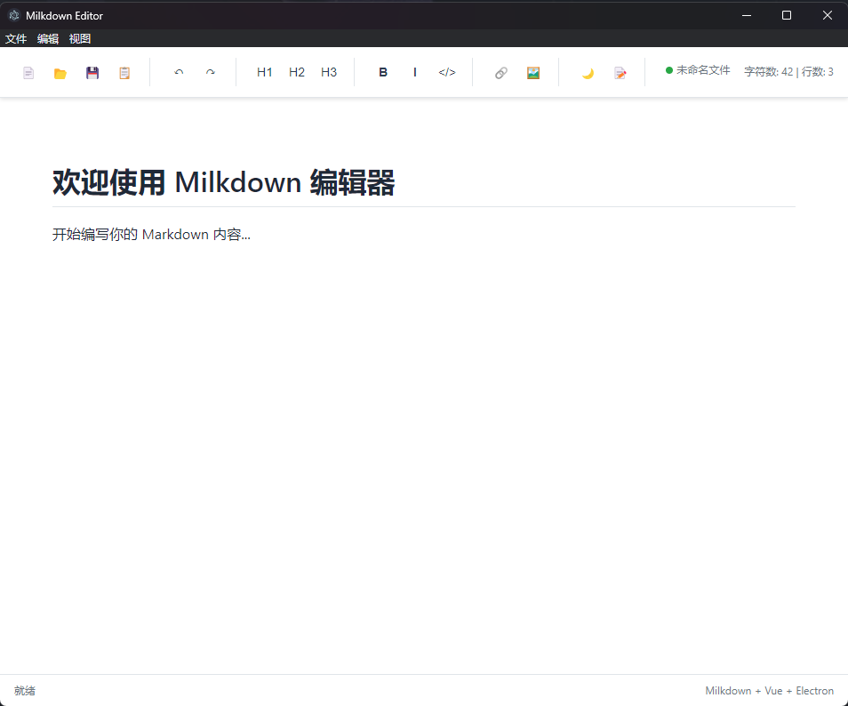

# CodeWithLiteMD

一个基于 Milkdown + Vue3 + Electron 的所见即所得 Markdown 编辑器。

## 功能特性
- 支持 GFM/标准 Markdown 语法
- 所见即所得编辑体验
- 代码高亮（Prism）
- 暗色/亮色模式切换
- 拼写检查开关
- 文件新建、打开、保存、另存为（Electron 菜单集成）
- 支持图片插入
- 响应式布局，适配桌面

## 截图

### 主界面


## 快速开始

1. 安装依赖
   ```sh
   cnpm install
   ```
2. 启动开发环境
   ```sh
   cnpm run dev
   ```
3. 打包
   ```sh
   cnpm run dist
   ```

## 目录结构
```
├── img/                # 截图和资源图片
├── src/                # 前端源码（Vue3）
├── src-electron/       # Electron 主进程与预加载
├── dist/               # 前端构建产物
├── dist-electron/      # Electron 构建产物
├── package.json        # 项目依赖
├── vite.config.ts      # Vite 配置
└── ...
```

## 鸣谢
- [Milkdown](https://milkdown.dev/)
- [Vue.js](https://vuejs.org/)
- [Electron](https://www.electronjs.org/)

---

> 本项目由 [Q1143316492](https://github.com/Q1143316492) 构建和维护。
